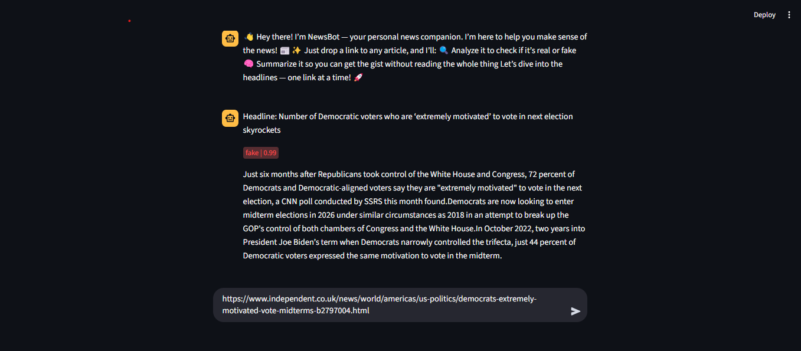

# U.S. Politics News Navigator: Fake News Detection & Summarization



In an era of information overload and rampant misinformation, the **U.S. Politics News Navigator** is a cutting-edge web application designed to empower users with reliable and concise news. This tool specifically targets U.S. political discourse, offering robust fake news detection and efficient article summarization.

By simply providing a news article URL, our application intelligently scrapes the content and leverages advanced deep learning models to deliver two critical insights: a classification of the news as real or fake, and a concise summary of the article's key points.

## ✨ Features

* **Intelligent Web Scraping:** Seamlessly extracts content from various news article URLs using the powerful `newspaper3k` library, handling diverse website structures.
* **Deep Learning-Powered Fake News Detection:** Employs sophisticated deep learning models to accurately classify U.S. political news as authentic or fabricated.
* **Concise News Summarization:** Generates accurate and brief summaries of lengthy articles, saving users valuable time.
* **Intuitive User Interface:** Provides a clean and easy-to-navigate experience for all users.

## 🛠️ Technologies Utilized

* **Python:** The core programming language for backend logic and machine learning.
* **FastAPI:** Powers the high-performance API for efficient data processing.
* **Streamlit:** Facilitates the creation of an interactive and user-friendly web interface.
* **Newspaper3k:** For robust and efficient news article web scraping.

## 🚀 Getting Started (Development)

To set up and run the application locally, follow these simple steps:

### Prerequisites

Make sure you have Python 3.8+ installed.

### Installation

1.  **Clone the repository:**
    ```bash
    git clone https://github.com/samuel-oluwemimo/fake_news_and_summarization_app.git
    cd your-repo-name
    ```

2.  **Install Dependencies:**
    It's recommended to use a virtual environment.
    ```bash
    python -m venv venv
    source venv/bin/activate  # On Windows use `venv\Scripts\activate`
    pip install -r requirements.txt
    ```

### Running the Application

1.  **Train Machine Learning Models:**
    If you've made changes to the models or need to retrain them, run:
    * **Classification Model:**
        ```bash
        python ml/classification/train.py
        ```
    * **Summarization Model:**
        ```bash
        python ml/summarization/train.py
        ```

2.  **Run the FastAPI Backend:**
    This will start the API server, typically on `http://127.0.0.1:8000`.
    ```bash
    fastapi dev app/main.py
    ```

3.  **Launch the Streamlit Frontend:**
    Open a *new* terminal window (keeping the FastAPI server running) and run:
    ```bash
    streamlit run app/app.py
    ```
    This will open the web application in your default browser, usually at `http://localhost:8501`.

## 🤝 Contributing

Contributions are welcome! Please feel free to open issues or submit pull requests.
